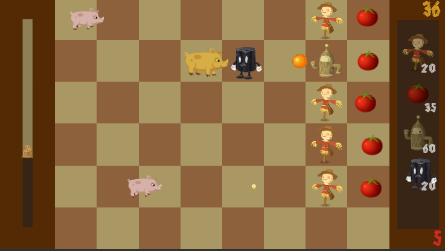
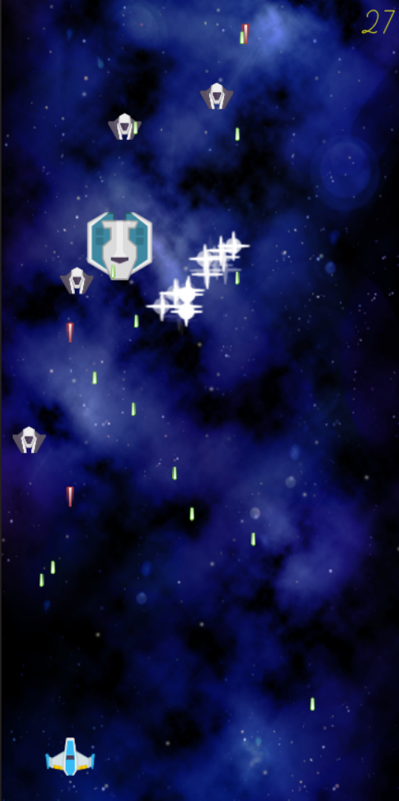
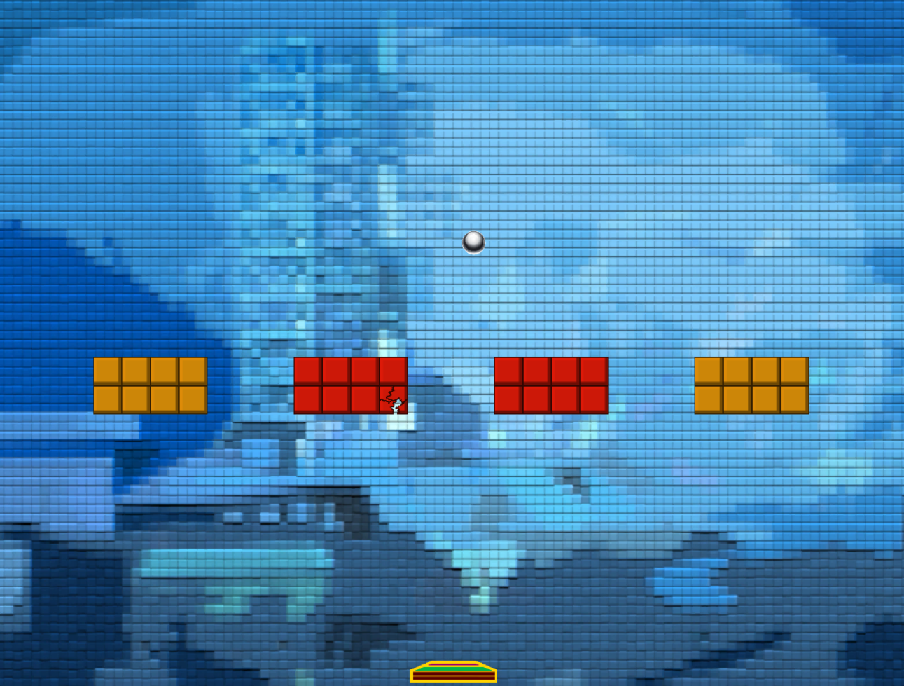

[Projects](#projects)
* [Beware the Pigs](#BewarePigs)
* [PewPew](#PewPew)
* [Blocky Breaky](#blocky)
* [Other Projects](#other)
  * [Better Soul Shards](#bss)

# Projects

The following projects were created as part of learning unity.

## Beware the Pigs 

**Beware the Pigs** is a small one level "Plants vs. Zombies"-type game. You can place a selection of defenders on a grid, and defend against incoming pigs.

Play it on [simmer.io](https://simmer.io/@digorath/beware-the-pigs).

## PewPew

In **PewPew** you control a spaceship trying to survive waves of enemy ships, which get increasingly fast, in a space invader type game.

Play it on [simmer.io](https://simmer.io/@digorath/pewpew).

## Blocky Breaky 

**Blocky Breaky** was one of the first unity projects I messed around with. It is a block breaker game with a few levels, where the ball accelerates for each block hit and decelerates when it hits the paddle.

Play it on [simmer.io](https://simmer.io/@digorath/blockybreaky).

## Other Projects

### Better Soul Shards

The addon Better Soul Shards was a small interface addon for World of Warcraft, which was relevant throughout the expanson Warlords of Draenor. Afterwards it was no longer needed, because of changes to the underlying game mechanics. 

It helped with keeping track of your resources as an affliction warlock.

Find it on [curseforge](https://www.curseforge.com/wow/addons/bss)